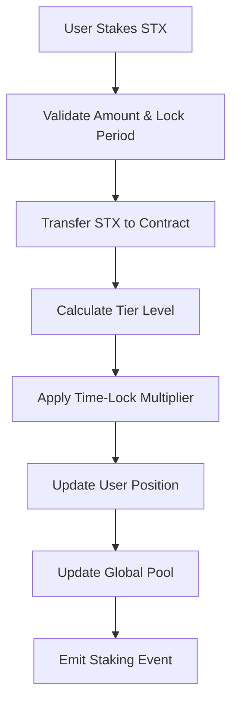
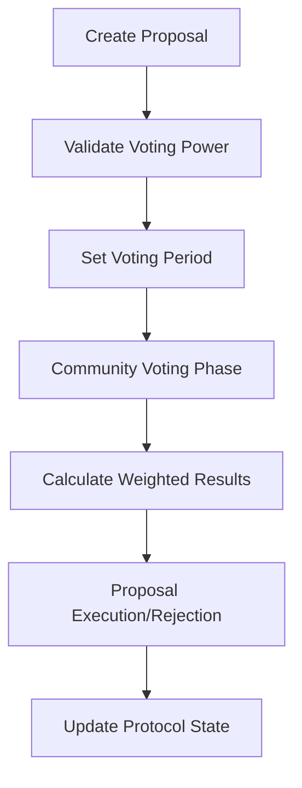
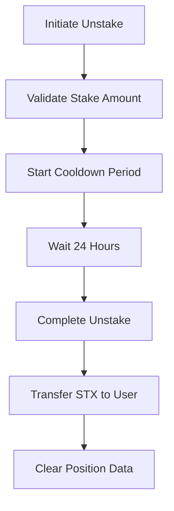

# StackSphere

## Bitcoin-Native Governance & Analytics Ecosystem

[](https://www.stacks.co/)
[](https://bitcoin.org/)
[](LICENSE)
[](https://github.com/stacksphere/core)

StackSphere is an innovative Bitcoin Layer 2 protocol built on Stacks that revolutionizes decentralized governance through intelligent staking mechanisms and data-driven decision making. The platform empowers Bitcoin believers to actively participate in protocol evolution while earning rewards for their commitment to the ecosystem.

## 🌟 Key Features

- **Multi-Tier STX Staking**: Exponential reward scaling based on commitment levels
- **Sophisticated Governance**: Proposal lifecycle automation with weighted voting
- **Time-Lock Rewards**: Enhanced returns for long-term token holders
- **Enterprise Security**: Emergency protocols and administrative safeguards
- **Bitcoin-Native**: Built exclusively on Bitcoin's security model through Stacks L2

## 🏗️ System Overview

StackSphere operates as a comprehensive governance ecosystem where STX token holders can:

1. **Stake STX tokens** with optional time-lock periods for enhanced rewards
2. **Participate in governance** through weighted voting based on stake commitment
3. **Earn tiered rewards** through a sophisticated multiplier system
4. **Access premium features** based on their tier level and voting power

The protocol targets Bitcoin maximalists, DeFi protocols, and institutional stakeholders, establishing a self-sustaining economy where network participation directly correlates with governance influence.

## 🏛️ Contract Architecture

### Core Components

```
StackSphere Protocol
│
├── Staking Engine
│   ├── Multi-tier System (Silver/Gold/Diamond)
│   ├── Time-lock Mechanisms
│   └── Reward Calculation Engine
│
├── Governance Framework
│   ├── Proposal Management
│   ├── Weighted Voting System
│   └── Execution Mechanisms
│
├── Security Layer
│   ├── Emergency Pause Controls
│   ├── Cooldown Periods
│   └── Administrative Safeguards
│
└── Analytics & Rewards
    ├── SPHERE Token Distribution
    ├── Voting Power Calculation
    └── Performance Metrics
```

### Tier System Architecture

| Tier | Minimum Stake | Reward Multiplier | Features |
|------|---------------|-------------------|----------|
| **Silver** | 1M STX | 1.0x | Basic staking, governance voting |
| **Gold** | 5M STX | 1.5x | Advanced analytics, priority support |
| **Diamond** | 10M STX | 2.0x | Premium features, early access |

### Time-Lock Multipliers

- **No Lock**: 1.0x base multiplier
- **1 Month**: 1.25x reward boost
- **2 Months**: 1.5x reward boost

## 📊 Data Flow

### Staking Flow



### Governance Flow



### Unstaking Flow



## 🔧 Technical Specifications

### Smart Contract Details

- **Language**: Clarity (Stacks)
- **Network**: Stacks Layer 2 on Bitcoin
- **Token Standard**: SIP-010 Fungible Token
- **Governance Model**: Weighted stake-based voting

### Key Parameters

- **Minimum Stake**: 1,000,000 μSTX (1 STX)
- **Base Reward Rate**: 5% annually
- **Cooldown Period**: 1,440 blocks (~24 hours)
- **Voting Period Range**: 100-2,880 blocks

### Security Features

- **Emergency Pause**: Contract owner can halt operations
- **Cooldown Protection**: Prevents rapid stake/unstake cycles
- **Minimum Thresholds**: Prevents spam proposals and micro-stakes
- **Time-lock Validation**: Ensures only valid lock periods

## 🚀 Getting Started

### Prerequisites

- Stacks Wallet (Leather, Xverse, or Hiro)
- STX tokens for staking
- Basic understanding of Bitcoin Layer 2

### Deployment

1. Deploy the contract to Stacks network
2. Initialize tier system configuration
3. Set initial parameters (reward rates, minimums)
4. Enable community participation

### Usage Examples

```clarity
;; Stake 5 STX with 1-month lock
(contract-call? .stacksphere stake-stx u5000000 u4320)

;; Create governance proposal
(contract-call? .stacksphere create-proposal 
  u"Increase reward rates by 1%" u1440)

;; Vote on proposal
(contract-call? .stacksphere vote-on-proposal u1 true)
```

## 📈 Economic Model

### Reward Distribution

Rewards are calculated using the formula:

```
Reward = (Stake × Base_Rate × Tier_Multiplier × Lock_Multiplier × Blocks) / Normalization_Factor
```

### Governance Economics

- **Voting Power**: Based on total staked STX and tier level
- **Proposal Threshold**: Minimum 1M STX voting power required
- **Execution Criteria**: Simple majority with minimum participation

## 🛡️ Security Considerations

- **Smart Contract Audits**: Recommended before mainnet deployment
- **Time-lock Mechanisms**: Prevent rapid manipulation
- **Emergency Controls**: Owner can pause in crisis situations
- **Gradual Decentralization**: Transition to community governance over time

## 🤝 Contributing

We welcome contributions from the Bitcoin and Stacks communities:

1. Fork the repository
2. Create feature branches
3. Submit pull requests with comprehensive tests
4. Follow our coding standards and documentation requirements
